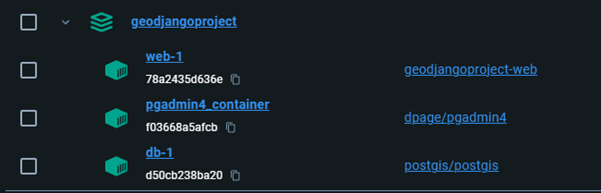

# GeoDjango Project
This Project has been created in the context of the Course "GIS".

# Members
- Badertscher Janis 
- Mabilliard Marie-Esther

# Installation Guide
- Clone the git repository
- Execute the docker-compose.yml
- Stop the web container (for now)
- Connect to the pg_admin4_container using the identifiers in the docker-compose.yml
- Connect the database server using db as name, postgresql as user and admin as password.
- Restart the web container
- Create a super user using python manage.py createsuperuser inside the web docker terminal
- Go to localhost:8000/admin, and login suing the super user identification
- You can now access localhost:8000/swissgeo

