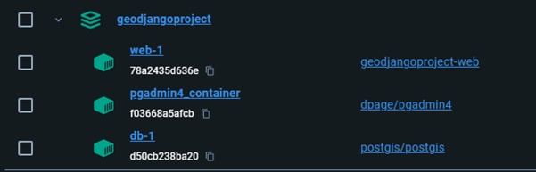

# GeoDjango Project
This Project has been created in the context of the Course "GIS Python" in the HES-SO Valais-Wallis course of 2024. Its goal was to manipulate and manage geographical data, creating a simple web application to do so.

# Members
- [Badertscher Janis](https://github.com/Satolix)
- [Mabillard Marie-Esther](https://github.com/Esvaria)

# Installation Guide
- Clone the git repository
- Execute the docker-compose.yml `docker-compose up`
- Inside the db docker logs, you will encounter issues. To fix them, you need to create folders inside the `data/db` repository.

Here is how your data repository should look like:

#### Keep in mind that these repositories can vary according to your system, so keep checking your docker db logs to see which ones are necessary for you.

- Then, connect to the pg_admin4_container using the identifiers in the docker-compose.yml
- Connect the database server using db as name, postgresql as `user` and `admin` as password.
- Go to `localhost:8000/admin`, and login using the superuser identification, `super` as username and `super` as password

You are now all setup to access `localhost:8000/swissgeo`, welcome

